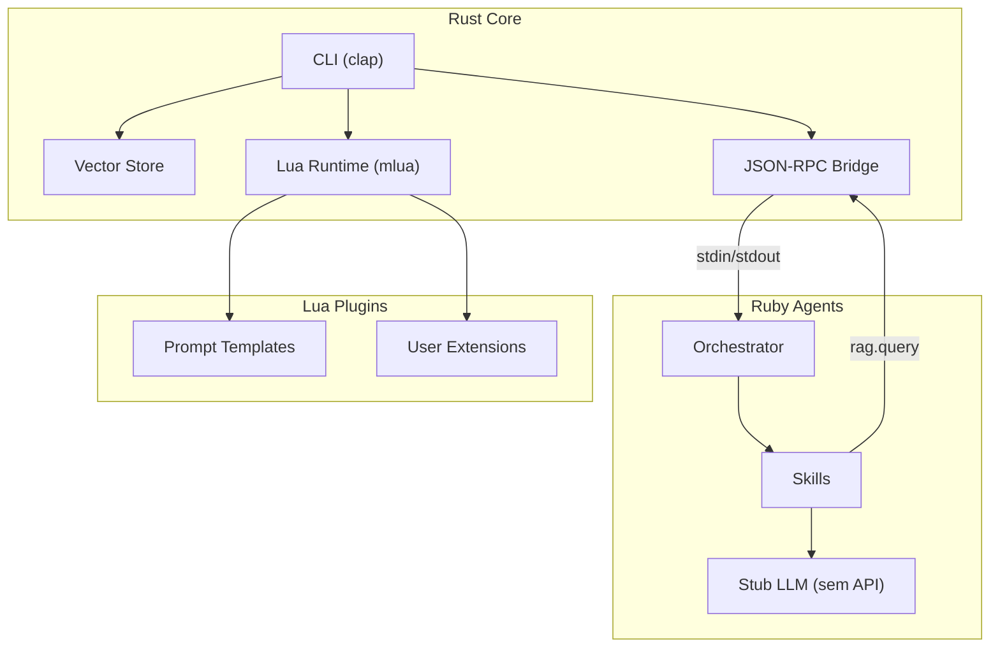

# DevAssist CLI — Plano de Aprendizado e Implementação

> Cópia do plano do projeto para consulta local.  
> **100% offline, sem API paga** — Rust + Ruby + Lua.  
> Status: fases 1–8 **implementadas** (ver [`.specify/CONTEXT.md`](../.specify/CONTEXT.md)).

## O que é o projeto

Um CLI polyglot que ajuda desenvolvedores no dia a dia:

- `devassist ask "pergunta"` — responde usando RAG nos docs do projeto
- `devassist execute plugin.lua` — roda plugins Lua
- `devassist security audit` — testa defesas contra prompt injection
- Agentes Ruby geram pesquisa/código/ADR e workflows RFC com aprovação humana

**Sem OpenAI, sem API paga.** Toda a "inteligência" vem de stubs que simulam o comportamento de um LLM real. Você aprende a **arquitetura e os padrões** — quando quiser plugar um modelo real (Ollama, OpenAI, etc.), basta trocar o stub por uma chamada HTTP.

---

## Glossário

**Tudo sobre conceitos fica em um só lugar:**

→ **[`docs/GLOSSARY.md`](./GLOSSARY.md)**

Não há glossário duplicado neste arquivo. O `PLAN.md` descreve o **projeto, arquitetura e fases**; o `GLOSSARY.md` explica **cada termo** (incluindo o mapa fase ↔ conceito).

---

## Arquitetura polyglot

- **Rust** = Core (CLI, vector store, Lua host, JSON-RPC bridge)
- **Ruby** = Agentes e workflows (orquestra skills, simula LLM via stubs)
- **Lua** = Plugins e prompt templates (extensível pelo usuário)



## Padrão SDD: GitHub Spec Kit (simplificado)

Usamos o fluxo do [GitHub Spec Kit](https://github.com/github/spec-kit) de forma manual (sem instalar nada). O ciclo é:

1. **Specify** — escrever `SPEC.md` definindo o que construir
2. **Plan** — escrever `PLAN.md` dizendo como construir
3. **Tasks** — quebrar em tarefas pequenas em `TASKS.md`
4. **Implement** — executar as tarefas
5. **Analyze** — validar que o código bate com a spec

Arquivos Spec Kit no projeto: [`.specify/SPEC.md`](../.specify/SPEC.md), [`.specify/PLAN.md`](../.specify/PLAN.md), [`.specify/CONTEXT.md`](../.specify/CONTEXT.md). Briefing do agente: [`AGENTS.md`](../AGENTS.md).

---

## Fases de aprendizado (roadmap)

### Fase 1 — SDD + PRD + Scaffold

#### O que você vai aprender
**Spec-Driven Development (SDD)** e **Product Requirements Document (PRD)**.

#### Explicação para iniciante
Imagine que você vai construir uma casa. Você começaria colocando tijolos direto, sem planta? Não — primeiro você faz a planta (o que tem a casa, quantos quartos, onde fica a cozinha). Só depois constrói.

SDD é a mesma coisa para software. Antes de escrever uma linha de código, você escreve um **SPEC.md** — um documento que diz exatamente o que o software faz. Esse documento é a "planta da casa". O código vem depois e precisa seguir a planta.

O **PRD** é ainda mais alto nível — é o briefing do produto. Responde: "O que estamos construindo? Pra quem? Qual problema resolve? Como sabemos que está pronto?"

#### Analogia do mundo real
- **Sem SDD**: "Vamos fazer um app de tarefas!" → coda 3 dias → percebe que esqueceu autenticação → refaz tudo.
- **Com SDD**: Escreve SPEC.md dizendo "o app precisa de auth, CRUD de tarefas, e notificações" → percebe logo que notificações são complexas → decide simplificar ANTES de codar.

#### Formato: GitHub Spec Kit
1. **Intent** — POR QUE estamos construindo isso
2. **Capabilities** — O QUE o sistema faz
3. **Boundaries/Constraints** — LIMITES
4. **Fora de escopo** — O que NÃO fazemos
5. **Success Signal** — Como sabemos que DEU CERTO

#### Entregáveis
- `.specify/SPEC.md`, `docs/PRD.md`, scaffold, git

---

### Fase 2 — ADR + Design Doc

#### O que você vai aprender
**Architecture Decision Records (ADR)** e **Design Documents**.

#### Explicação para iniciante
Todo projeto tem decisões técnicas. O problema é que 6 meses depois **ninguém lembra por quê**.

Um **ADR** registra Context → Decision → Consequences.  
Um **Design Doc** descreve *como* o sistema funciona por dentro.

#### Formato: MADR
Status, Context, Decision, Consequences, Alternatives Considered.

#### Entregáveis
- `docs/adr/001-RUST-FOR-CORE.md` … `004-JSONRPC-BRIDGE.md`
- `docs/design/ARCHITECTURE.md`

---

### Fase 3 — Rust Core + Lua Runtime

#### O que você vai aprender
**Plugin Systems** e **FFI** — como Rust executa Lua via `mlua`.

#### Analogia
- **Rust** = motor do carro  
- **Lua** = painel de controle  
- **mlua** = fios que conectam painel ao motor  

#### Entregáveis
- CLI `clap`, API Lua `log` / `register_skill` / `rag_query`, `hello.lua`

---

### Fase 4 — RAG Pipeline

#### O que você vai aprender
**RAG**, **Embeddings**, **Vector Store**, **Chunking**, **Cosine Similarity**.

#### Em 3 passos
1. Indexar docs → embeddings (stub hash)  
2. Buscar por similaridade  
3. Responder com contexto encontrado (grounding)

#### Entregáveis
- `vector_store`, `engine/rag.rs`, `rag_query.lua`

---

### Fase 5 — Ruby Agents + Skills

#### O que você vai aprender
**Agent Loop** think → plan → act → observe, **Skills**, **Orchestrator**.

#### Entregáveis
- `Agent`, `ResearchSkill`, `CodeGenSkill`, `RAGSkill`, `run.rb`

---

### Fase 6 — Workflows + RFC

#### O que você vai aprender
**Workflow**, **RFC**, **HITL**, **Guardrails**, **Audit Log**.

#### Pipeline
`RFC → Review → Approve → Implement → Verify` (com pergunta `[y/n]` no terminal)

#### Entregáveis
- `workflow_engine.rb`, `rfc_workflow.rb`, `docs/rfcs/TEMPLATE.md`

---

### Fase 7 — Prompt Engineering + Context Management

#### O que você vai aprender
**System Prompt**, **Few-Shot**, **Chain-of-Thought**, **Context Window**, **Templates**.

#### Entregáveis
- templates Lua + `prompt benchmark`

---

### Fase 8 — Segurança (Prompt Injection + Jailbreaking)

#### O que você vai aprender
**Prompt Injection**, **Jailbreaking**, **Input Sanitization**, **Output Validation**, **Evals**.

#### Entregáveis
- `security.rs`, payloads em `tests/security/`, ADR de defesas

---

## Estrutura de diretórios

```
devassist-cli/
  AGENTS.md
  .specify/
    SPEC.md
    PLAN.md
    CONTEXT.md
    COMMITS.md
  .cursor/skills/
  docs/
    GLOSSARY.md          # única fonte de definições
    PLAN.md              # arquitetura + fases (sem glossário duplicado)
    PRD.md
    adr/
    design/
    rfcs/
  core/                  # Rust
  agents/                # Ruby
  lua/                   # plugins + templates
  tests/security/
```

## Sobre LLMs: 100% stubs

```
[Seu código] → [LLM Client interface] → [Stub]
                                      → [Futuro: Ollama]
                                      → [Futuro: OpenAI]
```

## Referências

- [GitHub Spec Kit](https://github.com/github/spec-kit)
- [BMAD Method](https://github.com/bmad-code-org/BMAD-METHOD)
- [FullCycle multi-agents RAG](https://github.com/devfullcycle/techweekia9-multi-agents-rag)
- [MADR](https://adr.github.io/madr/)
- [OWASP LLM Top 10](https://owasp.org/www-project-top-10-for-large-language-model-applications/)
- [mlua](https://crates.io/crates/mlua)
