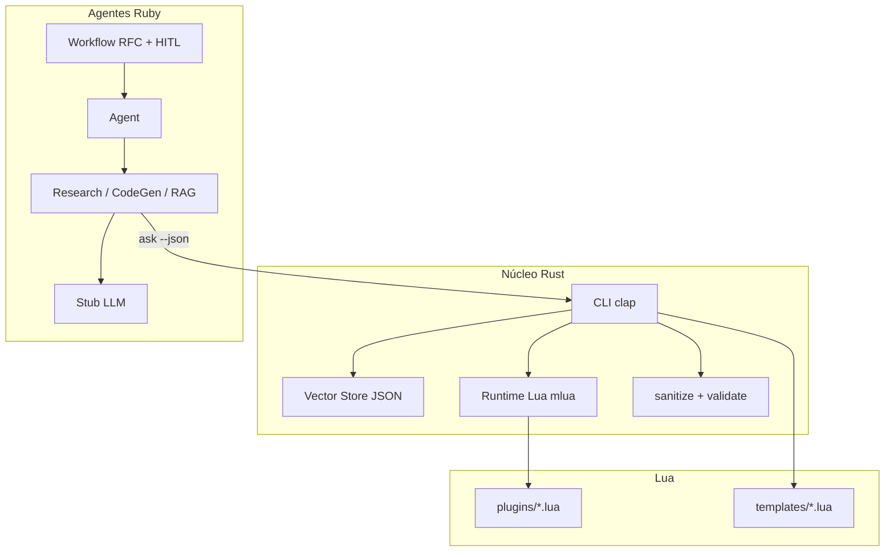

# DevAssist CLI — documento de design

Como o sistema se liga. O **quê** está em [SPEC.md](../../.specify/SPEC.md); o **porquê** está em `docs/adr/`.

## Camadas

| Camada | Caminho | Papel |
|--------|---------|--------|
| Núcleo Rust | `core/` | CLI, vector store, host Lua, segurança, benchmark de prompt |
| Agentes Ruby | `agents/` | Loop do agente, skills, workflow RFC |
| Lua | `lua/` | Plugins (`register_skill`) e templates de prompt (`render`) |

## Fluxo de dados

1. `rag index <dir>` percorre `*.md`, corta por títulos, faz embed stub e grava `vector_store.json`.
2. `ask` / `rag query` embedam a pergunta, ordenam por cosseno, filtram colisões fracas do stub e imprimem hits (e uma resposta stub ancorada).
3. `execute` carrega um arquivo Lua com `log`, `register_skill`, `rag_query`.
4. O `run.rb` Ruby planeja skills por palavras-chave, age e imprime observações.
5. `workflow.rb rfc` escreve um RFC, pergunta `Approve? [y/n]`, depois implementa/verifica ou aborta.

## Persistência

Vector store em memória mais `vector_store.json` no diretório de trabalho. Não é Qdrant.

## Stubs

Embeddings: hash de tokens → vetor unitário de 128 dimensões.  
Chat: strings determinísticas a partir de palavras-chave + chunks recuperados. Depois dá para trocar por Ollama/HTTP sem mudar os nomes das skills Lua/Ruby.
